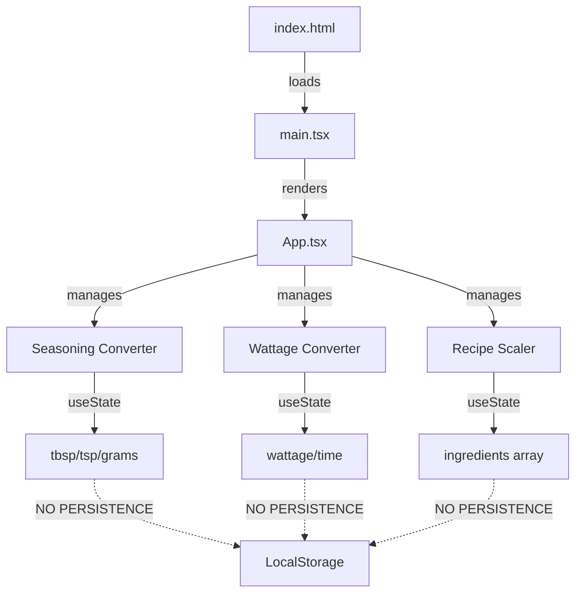
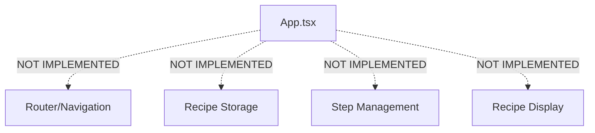

# T2 Architect Report

## Overview
This report provides architecture analysis and bug hypothesis for the reported issue: "Recipe steps are saved but not displayed."

## Key Finding: Functionality Does Not Exist

After thorough code analysis, **the core issue is that recipe step saving/displaying functionality has not been implemented yet**. The application currently only provides unit conversion tools.

## Current Architecture

### Application Structure

```
cooking_helper/
├── src/
│   ├── main.tsx          # Entry point (renders App component)
│   ├── App.tsx           # Main component with 3 tools (no routing)
│   ├── index.css         # Global styles
│   ├── pages/
│   │   └── Home.tsx      # Static home page (not integrated)
│   └── assets/           # Static assets
├── index.html            # HTML template
└── vite.config.ts        # Vite config (base: '/cooking_helper/')
```

### Data Flow Diagram (Current State)



### Missing Components



## Bug Cause Hypotheses

Since the recipe step functionality doesn't exist, the bug report likely refers to one of these scenarios:

### Hypothesis 1: Feature Not Yet Implemented (Most Likely)
**Root Cause**: Recipe step saving/displaying functionality was planned but never implemented.

**Evidence**:
- No `steps` state variable exists in App.tsx
- No localStorage or API calls for recipe data
- Home.tsx mentions "Recipe Collection" but is not integrated
- package.json includes `react-router-dom` but it's unused

**Location**: Entire feature missing from `src/App.tsx`

### Hypothesis 2: Outdated Documentation
**Root Cause**: README.md describes features that don't exist in the code.

**Evidence**:
- README mentions "HashRouter for GitHub Pages compatibility" - no routing exists
- README describes "Recipe Collection" feature - only has 3 conversion tools
- package.json has `react-router-dom` dependency but unused

**Location**: `README.md` lines 10, 21, 34

### Hypothesis 3: Home.tsx Not Connected
**Root Cause**: Home.tsx exists with recipe-related content but is not integrated.

**Evidence**:
- Home.tsx has "Recipe Collection" section
- App.tsx doesn't import or use Home.tsx
- No routing to switch between Home and tools

**Location**: `src/App.tsx` (missing Home import) and `src/main.tsx` (missing Router)

## Recommended Fix Approach

### Option A: Implement Recipe Step Feature (Full Solution)

1. **Add Recipe Type Definition**
```typescript
interface Recipe {
  id: string;
  name: string;
  ingredients: Ingredient[];
  steps: string[];
  servings: number;
}
```

2. **Add State Management**
```typescript
const [recipes, setRecipes] = useState<Recipe[]>([]);
const [currentRecipe, setCurrentRecipe] = useState<Recipe | null>(null);
```

3. **Add Persistence**
```typescript
useEffect(() => {
  const saved = localStorage.getItem('recipes');
  if (saved) setRecipes(JSON.parse(saved));
}, []);

useEffect(() => {
  if (recipes.length > 0) {
    localStorage.setItem('recipes', JSON.stringify(recipes));
  }
}, [recipes]);
```

4. **Integrate Routing**
```tsx
// Wrap with HashRouter in main.tsx
<HashRouter>
  <Routes>
    <Route path="/" element={<Home />} />
    <Route path="/tools" element={<App />} />
    <Route path="/recipe/:id" element={<RecipeDetail />} />
  </Routes>
</HashRouter>
```

### Option B: Quick Minimum Viable Product

Add a simple "Recipe Notes" textarea to the scaler tab that saves to localStorage:

```tsx
const [recipeSteps, setRecipeSteps] = useState('');

<input
  type="text"
  placeholder="Recipe steps (one per line)"
  value={recipeSteps}
  onChange={(e) => setRecipeSteps(e.target.value)}
/>
```

### Recommendation

**Implement Option A** - The application structure already suggests recipe management was intended. The missing piece is proper implementation rather than a bug in existing code.

## Next Steps

1. Create `src/types/recipe.ts` for type definitions
2. Implement `src/hooks/useRecipes.ts` for recipe state management
3. Create `src/pages/RecipeDetail.tsx` for recipe display
4. Add routing to `src/main.tsx`
5. Update `src/App.tsx` to integrate recipe features
6. Update `README.md` to match actual functionality

---

*Report generated by T2-Architect*
*Date: 2026-02-08*
