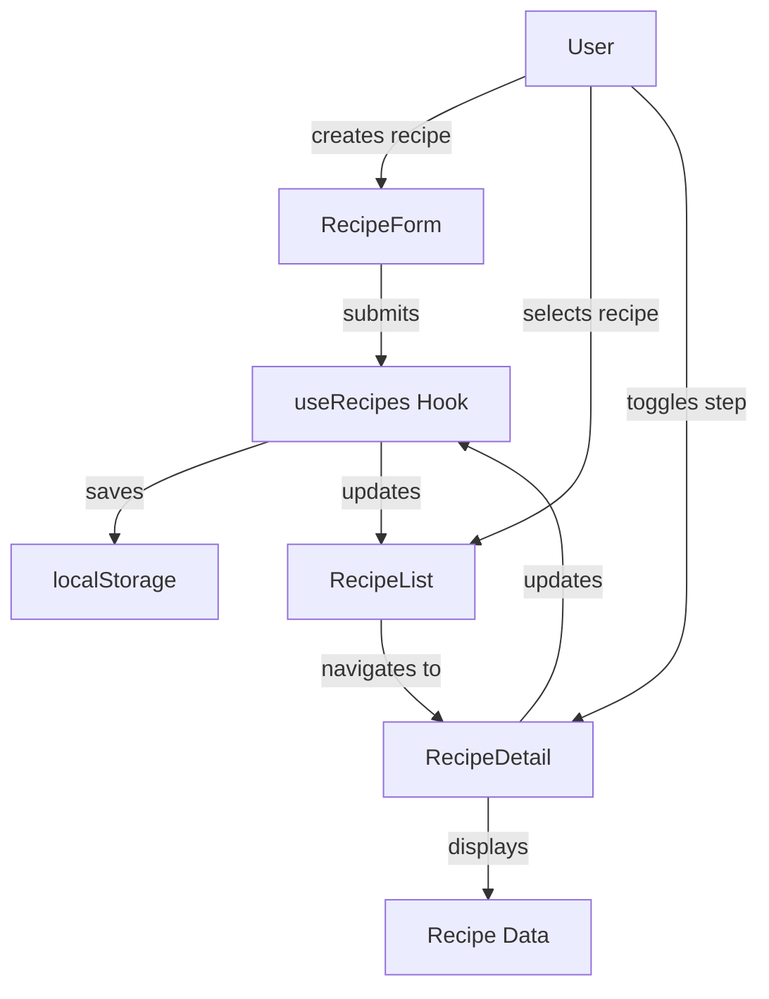

# T3: Bug Fix Specification

**Project:** Cooking Helper
**Date:** 2026-02-08
**Author:** SpecWriter (T3)
**Status:** Draft

---

## 1. Bug Definition

### 1.1 Bug Summary
**Reported Issue:** "手順が保存されるのに表示されない" (Recipe steps are saved but not displayed)

### 1.2 Root Cause Analysis
**Finding:** This is NOT a bug - it's a **missing feature**.

The application does not have any recipe storage or step display functionality implemented. The "Recipe Scaler" tab only scales ingredient amounts, not actual recipes with steps.

### 1.3 Reproduction Steps
1. Open the application at `http://localhost:5173/cooking_helper/`
2. Navigate to the third tab (Recipe Scaler / 人数変更)
3. Observe: No input field exists for recipe steps/instructions
4. Observe: No save button exists
5. Observe: No recipe list exists

### 1.4 Expected vs Actual Behavior

| Aspect | Expected Behavior | Actual Behavior |
|--------|------------------|-----------------|
| Step Input | Textarea/inputs for recipe steps | Not implemented |
| Save Function | Button to save recipe with steps | Not implemented |
| Storage | localStorage/DB persistence | No storage layer |
| Display | List of saved recipes with steps | Not implemented |
| Navigation | Router to navigate between pages | No routing configured |

---

## 2. Fix Specification

### 2.1 Implementation Approach
**Selected:** Option A - Full Recipe Feature Implementation

This aligns with the project's intended architecture (Home.tsx exists, react-router-dom is installed) and provides a complete solution.

### 2.2 Files to Create

| File | Purpose |
|------|---------|
| `src/types/recipe.ts` | Recipe and RecipeStep type definitions |
| `src/hooks/useRecipes.ts` | Custom hook for recipe state management |
| `src/pages/RecipeDetail.tsx` | Recipe display page with steps |
| `src/pages/RecipeList.tsx` | List of saved recipes |
| `src/pages/RecipeForm.tsx` | Recipe creation/editing form |
| `src/utils/storage.ts` | localStorage wrapper for recipes |

### 2.3 Files to Modify

| File | Changes Required |
|------|------------------|
| `src/main.tsx` | Add HashRouter wrapper and Routes configuration |
| `src/App.tsx` | Restructure as tools page, extract scaler logic |
| `src/index.css` | Add styles for recipe components |

---

## 3. Detailed Change Specifications

### 3.1 Type Definitions (`src/types/recipe.ts`)

```typescript
export interface RecipeStep {
  id: string;
  instruction: string;
  order: number;
  completed?: boolean;
}

export interface Recipe {
  id: string;
  name: string;
  servings: number;
  ingredients: Array<{
    id: string;
    name: string;
    amount: string;
  }>;
  steps: RecipeStep[];
  createdAt: string;
  updatedAt: string;
}

export interface RecipeFormData {
  name: string;
  servings: number;
  ingredients: Array<{ name: string; amount: string }>;
  steps: string[];
}
```

### 3.2 Storage Utility (`src/utils/storage.ts`)

```typescript
const RECIPE_STORAGE_KEY = 'cooking_helper_recipes';

export const recipeStorage = {
  getAll(): Recipe[] { /* ... */ },
  getById(id: string): Recipe | null { /* ... */ },
  save(recipe: Recipe): void { /* ... */ },
  delete(id: string): void { /* ... */ },
  clear(): void { /* ... */ }
};
```

### 3.3 Recipe Hook (`src/hooks/useRecipes.ts`)

```typescript
export function useRecipes() {
  const [recipes, setRecipes] = useState<Recipe[]>([]);
  const [loading, setLoading] = useState(true);

  useEffect(() => {
    // Load from localStorage on mount
  }, []);

  const addRecipe = (data: RecipeFormData) => { /* ... */ };
  const updateRecipe = (id: string, data: RecipeFormData) => { /* ... */ };
  const deleteRecipe = (id: string) => { /* ... */ };
  const getRecipe = (id: string) => recipes.find(r => r.id === id);

  return { recipes, loading, addRecipe, updateRecipe, deleteRecipe, getRecipe };
}
```

### 3.4 Main.tsx Routing (`src/main.tsx`)

```typescript
// Before
createRoot(document.getElementById('root')!).render(
  <StrictMode>
    <App />
  </StrictMode>
);

// After
createRoot(document.getElementById('root')!).render(
  <StrictMode>
    <HashRouter>
      <Routes>
        <Route path="/" element={<Home />} />
        <Route path="/tools" element={<App />} />
        <Route path="/recipes" element={<RecipeList />} />
        <Route path="/recipes/new" element={<RecipeForm />} />
        <Route path="/recipes/:id" element={<RecipeDetail />} />
        <Route path="/recipes/:id/edit" element={<RecipeForm />} />
      </Routes>
    </HashRouter>
  </StrictMode>
);
```

### 3.5 App.tsx Refactoring

Extract the scaler tab into a reusable component that can be used both in the tools page and in recipe context.

---

## 4. Component Specifications

### 4.1 RecipeForm Component

**Props:**
- `recipe?: Recipe` - Optional, for edit mode
- `onSubmit: (data: RecipeFormData) => void`
- `onCancel: () => void`

**Features:**
- Recipe name input
- Servings input
- Dynamic ingredient list (add/remove rows)
- Dynamic step list (add/remove rows)
- Save/Cancel buttons

### 4.2 RecipeDetail Component

**Props:**
- `recipeId: string`

**Features:**
- Display recipe name, servings
- Display ingredients table
- Display steps as checklist
- Edit button
- Delete button
- Scale servings (reuse scaler logic)

### 4.3 RecipeList Component

**Features:**
- Grid/list view of saved recipes
- Search/filter functionality
- Create new recipe button
- Delete confirmation

---

## 5. Data Flow Diagram



---

## 6. Impact Analysis

### 6.1 Breaking Changes
- None - this adds new functionality

### 6.2 Affected Areas
- **Routing:** All navigation now goes through HashRouter
- **URL Structure:** New routes for recipes
- **Storage:** localStorage will contain recipe data
- **Bundle Size:** Increase due to new components and react-router-dom usage

### 6.3 Dependencies
- Already installed: `react-router-dom` (currently unused)
- No new dependencies required

---

## 7. Verification Plan

### 7.1 Test Cases

| ID | Test Case | Expected Result |
|----|-----------|-----------------|
| V1 | Create recipe with steps | Recipe appears in list |
| V2 | View recipe details | All steps displayed |
| V3 | Toggle step completion | Step marked visually |
| V4 | Edit recipe | Changes persist after refresh |
| V5 | Delete recipe | Removed from list and storage |
| V6 | Scale recipe servings | Ingredient amounts update correctly |
| V7 | Navigate routes | All routes accessible via HashRouter |
| V8 | Browser refresh | Recipe data persists from localStorage |

### 7.2 Manual Testing Steps

1. **Create Recipe Flow:**
   - Navigate to `/recipes/new`
   - Fill in recipe name, servings
   - Add 3+ ingredients
   - Add 3+ steps
   - Click Save
   - Verify: Redirected to recipe detail page

2. **Display Steps Flow:**
   - From recipe detail, verify all steps are visible
   - Click steps to mark as complete
   - Verify visual feedback (strikethrough/checkmark)

3. **Persistence Flow:**
   - Create a recipe
   - Refresh browser (F5)
   - Navigate to `/recipes`
   - Verify: Recipe still exists

4. **Navigation Flow:**
   - From home, click "Recipe Collection"
   - Verify: Navigates to `/recipes`
   - Click a recipe
   - Verify: Navigates to `/recipes/:id`

### 7.3 Edge Cases to Test

| Scenario | Expected Behavior |
|----------|------------------|
| Empty recipe name | Validation error |
| No ingredients | Warning, but allow save |
| No steps | Warning, but allow save |
| Very long step text | Text wraps, no overflow |
| Special characters in name | Saved and displayed correctly |
| localStorage full | Graceful error handling |
| Invalid recipe ID | 404 page or redirect to list |

---

## 8. Implementation Order

1. **Phase 1: Foundation** (T4-Impl-Core)
   - Create type definitions
   - Implement storage utility
   - Create useRecipes hook

2. **Phase 2: Components** (T4-Impl-Core)
   - Build RecipeForm component
   - Build RecipeDetail component
   - Build RecipeList component

3. **Phase 3: Integration** (T5-Impl-Edge)
   - Add routing to main.tsx
   - Refactor App.tsx
   - Add navigation to Home.tsx

4. **Phase 4: Edge Cases** (T5-Impl-Edge)
   - Error handling
   - Empty states
   - Loading states

---

## 9. Success Criteria

A successful implementation will be achieved when:

- [ ] User can create a recipe with name, servings, ingredients, and steps
- [ ] All steps are displayed on the recipe detail page
- [ ] Recipe data persists across browser sessions
- [ ] All routes are accessible via HashRouter
- [ ] No console errors during normal usage
- [ ] Application works on GitHub Pages (hash routing)

---

## 10. Notes

### 10.1 Additional Findings from T1

The T1 report identified a minor bug in the scaler function:
```typescript
// Line 93 in App.tsx
.toFixed(selectedSeasoning.name === 'Liquid' ? 1 : 0);
```
This condition is always false (no seasoning named "Liquid"). This should be fixed as a separate issue.

### 10.2 Documentation Updates Required

- README.md should reflect new recipe features
- Screenshots should be updated
- Setup instructions may need updating for GitHub Pages deployment

---

*Specification generated by T3-SpecWriter*
*Based on reports from T1-RepoArchaeologist and T2-Architect*
